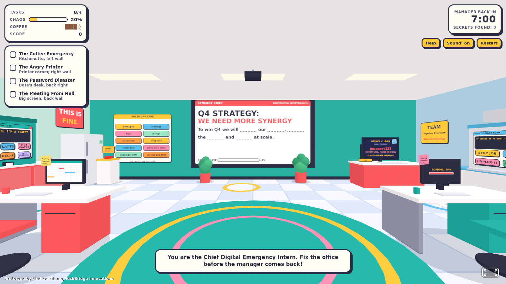
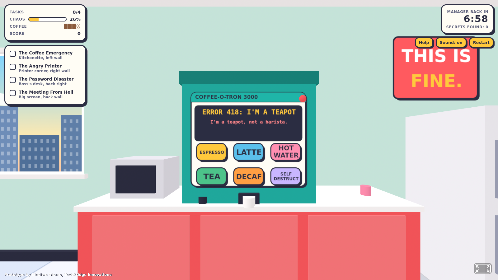
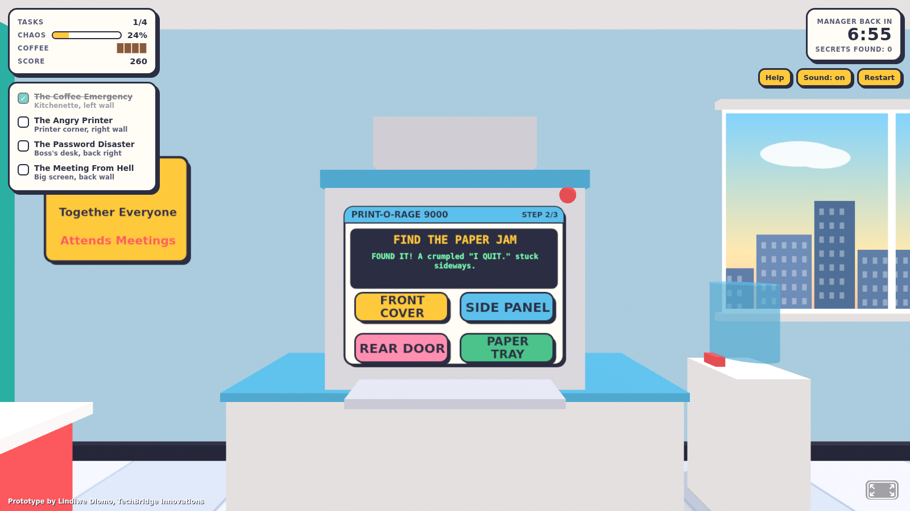
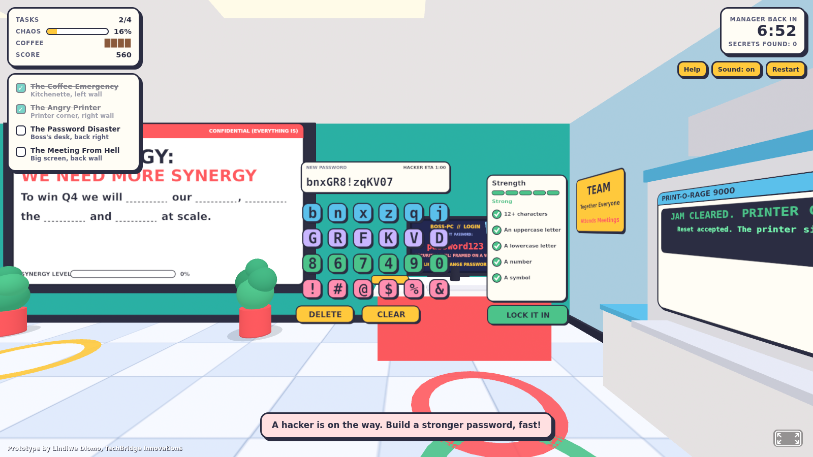
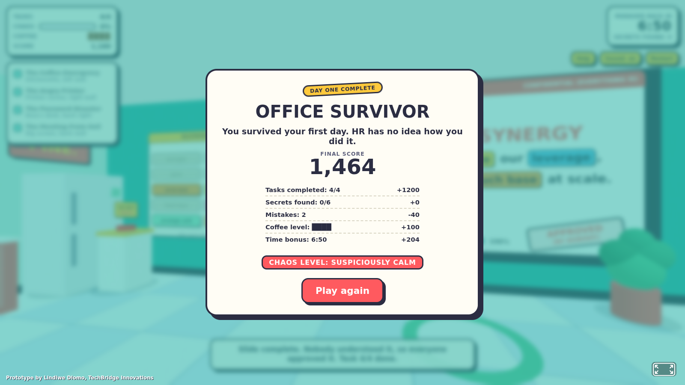
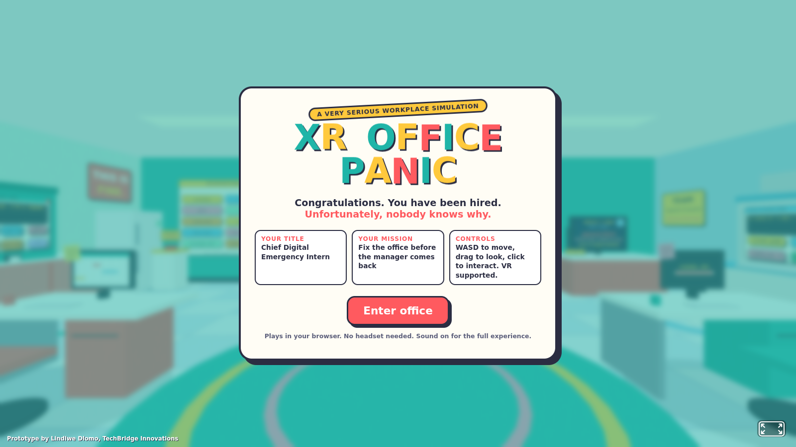
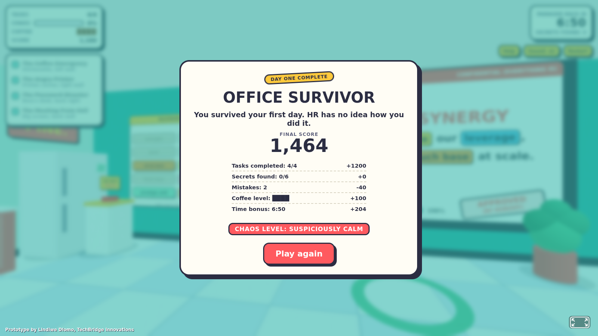

# XR Office Panic

**The world's most unqualified office.** A comedy WebXR game where you are the new *Chief Digital Emergency Intern* and must fix a ridiculous virtual office before the manager comes back.

**Play it:** `https://lindiwed-collab.github.io/AR-VR-Portfolio/XR-Office-Panic/`

Plays on a laptop, on a phone, or in a VR headset. No install, no account, no plugins.



## The four emergencies

| Task | What goes wrong | What you do |
| --- | --- | --- |
| The Coffee Emergency | The machine shows `ERROR 418: I'M A TEAPOT` | Find the one correct button among six |
| The Angry Printer | It has printed 47 copies of "I QUIT." | Stop the job, find the paper jam, press the right control |
| The Password Disaster | The boss's password is `password123` and a hacker is minutes away | Build a strong replacement before the Hacker ETA runs out |
| The Meeting From Hell | A slide reads "Q4 STRATEGY: WE NEED MORE SYNERGY" | Throw corporate buzzwords at it until it is complete |

Finish all four before the **Manager back in** clock hits zero. There are also **six hidden secrets** around the office. Poke around.

## Controls

| Device | Move | Look | Interact |
| --- | --- | --- | --- |
| Laptop or desktop | `W A S D` or arrow keys | Drag the mouse | Click |
| Phone or tablet | On-screen thumb stick | Drag, or move the phone | Tap |
| VR headset | Left stick | Turn your head, right stick snap-turns | Trigger |

## Scoring

- **Tasks:** +300 each
- **Secrets:** +50 each, plus a bonus for connecting a certain set of sticky notes
- **Mistakes:** -20 each, and every wrong answer raises the **Office Chaos** meter
- **Coffee level:** drains while the machine is broken, and is worth points at the end
- **Time bonus:** finish early to keep more of the clock

Your final rank runs from *Fired (with honours)* up to *Employee of the month*, with a separate Chaos Level from *Suspiciously calm* to *Legendary*.

## Screenshots

| | |
| --- | --- |
|  |  |
|  |  |
|  |  |

## What it demonstrates

- **XR interaction design:** one point-and-select model that works with a mouse, a finger or a VR controller ray
- **Spatial UI:** every control panel is drawn to canvas and placed in 3D, so text stays sharp at arm's length
- **Game design:** four distinct mission mechanics (button hunt, multi-step repair, timed puzzle, throw-to-complete), a scoring system, a shared chaos meter, a countdown and hidden secrets
- **Environmental storytelling:** the office, its posters and its screens tell the joke before you read a word
- **Accessible onboarding:** playable instantly in a browser, with VR as an upgrade rather than a requirement

## Built with

- [A-Frame](https://aframe.io) 1.7.0 (MIT licence), bundled in `assets/aframe.min.js`
- WebXR, JavaScript, HTML Canvas and the Web Audio API
- No image, model or sound files: the whole office and every sound effect is generated in code

## Run it locally

```bash
python3 -m http.server 8000
# open http://localhost:8000/
```

VR mode needs HTTPS, which GitHub Pages provides.

## Tweak the game

Near the top of the script in `index.html` there is a **SETTINGS** block:

```js
const MANAGER_MINUTES = 7;        // time before the manager walks back in
const COFFEE_DRAIN_SECONDS = 45;  // how fast the coffee level drops
const HACKER_SECONDS = 60;        // the hacker ETA in the password task
const POINTS = { mission: 300, secret: 50, notesBonus: 100, mistake: 20, coffeeBar: 25 };
```

## Author

Lindiwe Dlomo, Johannesburg, South Africa
[LinkedIn](https://linkedin.com/in/lindiwedlomo-b50050b8) | [GitHub](https://github.com/LindiweD-Collab)
